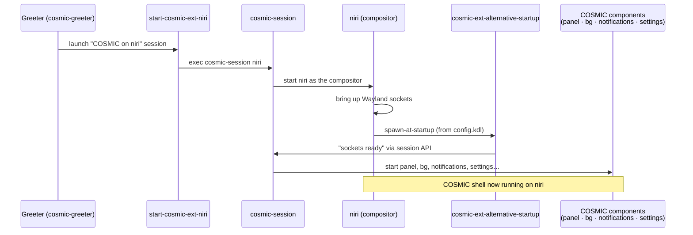

# COSMIC on niri

A second desktop session that runs **COSMIC's components** (panel, settings
daemon, notifications, launcher, background…) on top of **[niri](https://github.com/YaLTeR/niri)**
— a *scrollable-tiling* Wayland compositor — instead of COSMIC's own compositor,
`cosmic-comp`. You keep the COSMIC look and apps, but get keyboard-first tiling
window management.

> **Opt-in and Linux-only.** This is not part of the everyday `install.sh`. It
> builds niri from source and writes system files with `sudo`, so it has its own
> script: [`niri/install-cosmic-niri.sh`](../niri/install-cosmic-niri.sh). There
> is no Windows counterpart — COSMIC and niri are Linux-only, so this sits
> *outside* the cross-platform `install.{sh,ps1}` pair on purpose.

- niri docs: <https://yalter.github.io/niri/>
- The glue project: <https://github.com/Drakulix/cosmic-ext-extra-sessions>
- Your config: `niri/config.kdl` → linked to `~/.config/niri/config.kdl`

---

## Why

The repo's first goal is *faster, better keyboard navigation*. niri is built
around that: windows live in an infinite horizontal strip of columns, you move by
**focusing left/right** and **scrolling**, and nothing overlaps unless you ask.
COSMIC's stock compositor is a floating/auto-tiling hybrid; niri is pure tiling
with a genuinely different (and very keyboard-driven) model — without giving up
COSMIC's panel, theming, settings, and first-party apps.

It's also a low-commitment experiment: it's a *separate* session entry, so stock
COSMIC is untouched and one log-out away.

---

## How it works

The whole thing hinges on one fact: a recent `cosmic-session` can boot **any**
compositor, not just `cosmic-comp` (added in
[pop-os/cosmic-session#75](https://github.com/pop-os/cosmic-session/pull/75),
already in Pop!_OS 24.04's stock `cosmic-session` 1.0.0).

The greeter entry runs a small start script that does
`exec cosmic-session niri`. `cosmic-session` launches niri as the compositor,
then niri — at startup — spawns **`cosmic-ext-alternative-startup`**, a tiny
helper that talks to the session API once all the Wayland sockets are up. That
handshake is the signal for `cosmic-session` to bring up the rest of COSMIC
(panel, background, notifications, settings daemon…).



The three moving parts the installer puts in place:

| Piece | What it is | Where it lands |
|-------|------------|----------------|
| `niri` | the compositor, built from source (not packaged for 24.04) | `/usr/local/bin/niri` |
| `cosmic-ext-alternative-startup` | the session-API handshake helper | `/usr/local/bin/` |
| `start-cosmic-ext-niri` + `.desktop` | the launcher script + greeter entry | `/usr/local/bin/`, `/usr/local/share/wayland-sessions/` |

---

## Install

```bash
./niri/install-cosmic-niri.sh
```

It's idempotent — safe to re-run to pull and rebuild the latest niri. In order it:

1. **apt-installs** `just` (the recipe runner the glue repo uses) plus niri's
   build deps (`clang`, `libgbm-dev`, `libinput-dev`, `libpipewire-0.3-dev`, …).
2. **Builds niri** from source into `/usr/local/bin/niri`. niri isn't in the
   Pop!_OS 24.04 repos and the community PPA only covers Ubuntu 25.10+, so source
   is the only route. The build is large (a few minutes) but only needs the
   `niri` binary — none of niri's own session files, since `cosmic-session` owns
   the session.
3. **Builds + installs** the session glue (`just build && sudo just install-niri`).
4. **Links** `niri/config.kdl` → `~/.config/niri/config.kdl`.

Source trees are cloned under `~/src` (override with `SRC_DIR=…`).

Then **log out** and choose **"COSMIC on niri"** from the session menu on the
greeter (usually a gear/menu icon near the password box).

---

## The config

`niri/config.kdl` is niri's well-commented default with three COSMIC-specific
changes — everything else (the full set of navigation/tiling binds) is stock and
documented inline:

1. **Startup helper instead of a bar.** The default config starts `waybar`; we
   start the required handshake helper instead, because COSMIC provides its own
   panel:
   ```kdl
   spawn-at-startup "cosmic-ext-alternative-startup"
   ```
   niri honours layer-shell exclusive zones, so `cosmic-panel` reserves its own
   space automatically — no `struts` needed.

2. **COSMIC apps + tools on the binds.** App launches and screenshots all route
   to COSMIC's own binaries so the session feels like stock COSMIC:

   | Bind | Action |
   |------|--------|
   | `Mod+T` | `wezterm` (terminal) |
   | `Mod+D` | `cosmic-launcher` |
   | `Mod+Shift+D` | `cosmic-app-library` |
   | `Mod+Alt+L` | `cosmic-greeter` (lock) |
   | `Print` / `Ctrl+Print` | `cosmic-screenshot` (interactive / full screen) |

   `Mod` is **Super** when running on a real session (it's Alt only inside a
   nested window).

   The hardware media keys are *not* COSMIC binaries because COSMIC has no
   first-party CLI for them — but they're already the COSMIC path: volume goes
   through `wpctl` (COSMIC's wireplumber), brightness through `brightnessctl`,
   and media keys through `playerctl` (MPRIS). In every case `cosmic-osd` draws
   the on-screen overlay, exactly as under stock `cosmic-comp`. The installer
   apt-gets `brightnessctl` + `playerctl` so these binds aren't dead.

3. **Centered 80% main column.** `default-column-width` is `0.8` and
   `center-focused-column "always"`, so the focused window sits in the middle of
   the screen at ~80% width with even gutters. `Mod+R` cycles ½ · ⅔ · 80%.

### Keys worth knowing (all stock niri)

| Bind | Action |
|------|--------|
| `Mod+H/J/K/L` or arrows | focus column left / window down / up / column right |
| `Mod+Ctrl+H/J/K/L` | move the window/column |
| `Mod+R` | cycle column width presets (½ · ⅔ · 80%) |
| `Mod+F` / `Mod+Shift+F` | maximize column / fullscreen |
| `Print` / `Ctrl+Print` | COSMIC screenshot: interactive picker / full screen |
| `Alt+Print` | niri single-window grab |
| `Mod+,` / `Mod+.` | consume / expel window into-or-out-of a column |
| `Mod+1…9` | focus workspace N |
| `Mod+O` | overview (zoomed-out workspaces) |
| `Mod+Q` | close window |
| `Mod+Shift+Slash` | the full hotkey overlay (cheat sheet) |
| `Mod+Shift+E` | quit the session (with confirmation) |

Press `Mod+Shift+/` (i.e. `Mod+?`) in-session any time for the complete,
always-correct list. The config is **live-reloaded** on save — tweak
`niri/config.kdl` and changes apply instantly.

---

## Caveats

This is **alpha** software stacked on alpha software (the glue repo says so
itself). Expect rough edges: some COSMIC applets assume `cosmic-comp` and may
misbehave, screen-sharing/portals can be flaky, and bugs should be reproduced
against **stock COSMIC** before blaming niri or COSMIC upstream. Stock COSMIC is
always one log-out away, so nothing here is destructive.

---

## Troubleshooting

| Symptom | Fix |
|---------|-----|
| "COSMIC on niri" missing from the greeter | Re-run the installer; confirm `/usr/local/share/wayland-sessions/cosmic-ext-niri.desktop` exists |
| Logs in to a black screen / no panel | The handshake helper didn't run — check `spawn-at-startup "cosmic-ext-alternative-startup"` is in `~/.config/niri/config.kdl`, and that the binary is on PATH |
| `niri` not found at login | The binary install step failed — re-run the installer; check `/usr/local/bin/niri` |
| Config change not applying | niri live-reloads on save; run `niri validate ~/.config/niri/config.kdl` to spot KDL errors |
| Want stock COSMIC back | Just log out and pick "COSMIC" — nothing was removed |
